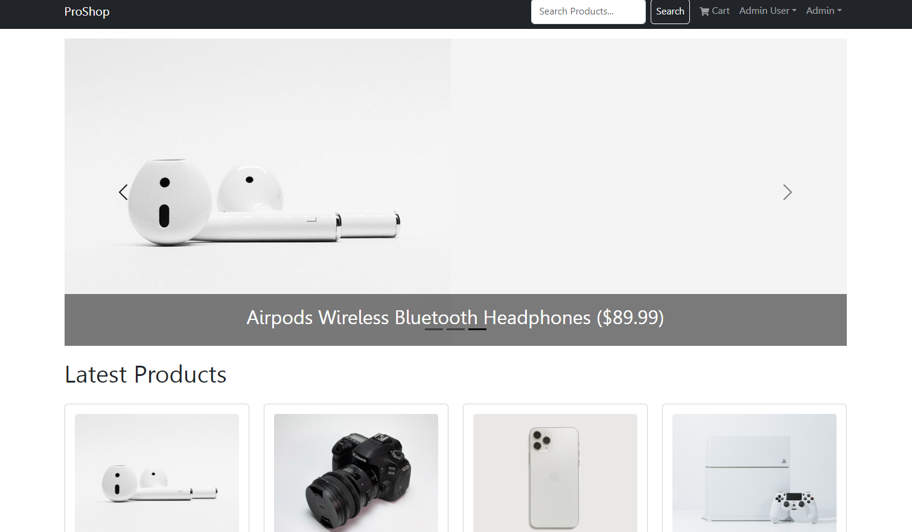

# Binyamin-Mern-Web-Shop

> Full stack application for a web eCommerce shop built using the MERN stack (MongoDB, Express, React, Node.js).




<!-- toc -->

- [Features](#features)
- [Usage](#usage)
  - [Env Variables](#Environment-Variables)
  - [Install Dependencies (frontend & backend)](#install-dependencies-frontend--backend)
  - [Run](#run)
- [Build & Deploy](#build--deploy)
  - [Seed Database](#seed-database)

* [Bug Fixes, corrections and code FAQ](#bug-fixes-corrections-and-code-faq)
* [License](#license)

<!-- tocstop -->

## Features

- Full featured shopping cart
- Product reviews and ratings
- Top products carousel
- Product pagination
- Product search feature
- User profile with orders
- Admin product management
- Admin user management
- Admin Order details page
- Mark orders as delivered option
- Checkout process (shipping, payment method, etc)
- PayPal / credit card integration
- Database seeder (products & users)

## usage

- Create a MongoDB database and obtain your `MongoDB URI` - [MongoDB Atlas](https://www.mongodb.com/cloud/atlas/register)
- Create a PayPal account and obtain your `Client ID` - [PayPal Developer](https://developer.paypal.com/)

### Environment Variables

Rename the `.env.example` file to `.env` and add the following

```
NODE_ENV = development
PORT = 5000
MONGO_URI = your mongodb uri
JWT_SECRET = 'abc123'
PAYPAL_CLIENT_ID = your paypal client id
PAGINATION_LIMIT = 8
```

Change the JWT_SECRET and PAGINATION_LIMIT to your preferred values

### Install Dependencies (frontend & backend)

```
npm install
cd frontend
npm install
```

### Run

```

# Run frontend (:3000) & backend (:5000)
npm run dev

# Run backend only
npm run server
```

## Build & Deploy

```
# Create frontend prod build
cd frontend
npm run build
```

### Seed Database

You can use the following commands to seed the database with some sample users and products as well as destroy all data

```
# Import data
npm run data:import

# Destroy data
npm run data:destroy
```

```
Sample User Logins

admin@email.com (Admin)
123456

john@email.com (Customer)
123456

jane@email.com (Customer)
123456
```

---

## Bug Fixes, corrections and code FAQ

empty for now 
---

## License

This project is licensed under the MIT License. See the LICENSE file for more details.


---

## Contact Information
For any questions or support, please reach out to me via email: benhazoom12@gmail.com

---

## Acknowledgments
I would like to acknowledge Brad Traversy, Full Stack Web Developer & Instructor at Traversy Media, for his major help in making this project.
The course for this project can be found here [MERN Stack From Scratch | eCommerce Platform](https://www.traversymedia.com/mern-stack-from-scratch) course.


---

## Credits
This project was developed as part of a course taught by Brad Traversy. The original code and structure were created by Brad Traversy, and parts of this README were adapted from his original project README. His guidance and resources were invaluable in the creation of this project.
